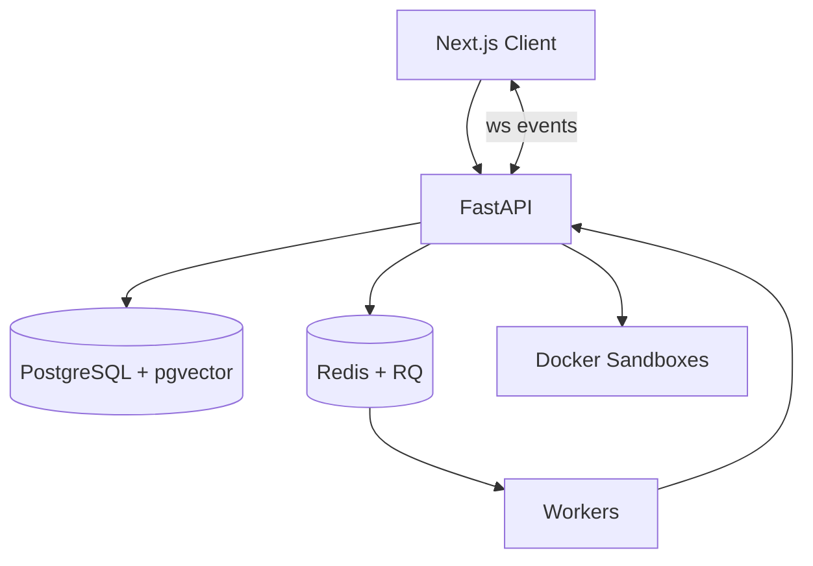

# DevExec Sentinel

DevExec Sentinel is a full-stack reliability platform that blends an agent runtime, sandboxed execution, and semantic memory with a modern operations UI. It provides real-time telemetry, artifact capture, and execution intelligence across project contexts.

## Highlights

- Agent registry with execution policies, tool permissions, and memory configuration
- Sandboxed tool execution using Docker containers per runtime session
- Realtime telemetry with event replay and live streaming
- Semantic memory backed by pgvector for context-aware planning
- Next.js client with workspace, agent studio, and task command center

## Architecture



## Repository layout

- client/ - Next.js UI, agent studio, workspace, and telemetry views
- server/ - FastAPI API, agent runtime, sandbox orchestration, and memory services

## Quick start (local)

1. Start backend dependencies

```bash
cd server
docker compose up -d postgres redis
```

2. Build the sandbox image

```bash
cd server
docker build -t devexec-sandbox:latest -f sandbox/Dockerfile .
```

3. Install and run the backend

```bash
cd server
pip install -r requirements.txt
uvicorn app.main:app --reload --host 0.0.0.0 --port 8000
```

4. Run the worker in a second terminal

```bash
cd server
python -m app.workers.worker
```

5. Install and run the client

```bash
cd client
npm install
npm run dev
```

Open http://localhost:3000.

## Documentation

- Client guide: [client/README.md](client/README.md)
- Server guide: [server/README.md](server/README.md)

## Environment

- Server settings live in server/.env (see server/README.md)
- Client settings live in client/.env.local (see client/README.md)
