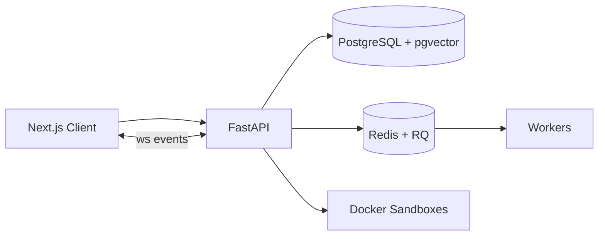

# DevExec Sentinel Backend

FastAPI backend for DevExec Sentinel. It powers the task engine, agent runtime, sandboxed execution, and intelligence layer with realtime telemetry and artifact persistence.

## Architecture



## Core systems

- Task execution engine with retries, validation, and reports
- Agent runtime with policies, permissions, and execution history
- Sandboxed tool execution using Docker containers
- Intelligence layer with semantic retrieval and working memory
- Telemetry pipeline with replay + live streaming

## Key endpoints

Tasks

- POST /tasks
- GET /tasks/{task_id}
- GET /tasks/{task_id}/summary
- GET /tasks/{task_id}/report?format=json|markdown
- GET /tasks/{task_id}/events
- WS /ws/tasks/{task_id}

Agents

- GET /agents
- POST /agents
- PATCH /agents/{agent_id}
- PUT /agents/{agent_id}/permissions
- POST /agents/{agent_id}/executions
- GET /agents/executions/{execution_id}
- GET /agents/executions/{execution_id}/events
- WS /agents/ws/executions/{execution_id}

Sandboxes

- POST /sandboxes/workspaces
- POST /sandboxes
- POST /sandboxes/{sandbox_id}/execute
- POST /sandboxes/{sandbox_id}/stop
- GET /sandboxes/{sandbox_id}/events
- WS /sandboxes/ws/sandboxes/{sandbox_id}

Intelligence

- POST /intelligence/projects/{project_id}/ingest
- POST /intelligence/retrieve
- GET /intelligence/projects/{project_id}/knowledge

Webhook and health

- POST /webhook/deploy
- GET /health

## Setup

1. Install dependencies

```bash
pip install -r requirements.txt
```

2. Start PostgreSQL and Redis

```bash
docker compose up -d postgres redis
```

3. Build the sandbox image

```bash
docker build -t devexec-sandbox:latest -f sandbox/Dockerfile .
```

4. Run the API server

```bash
uvicorn app.main:app --reload --host 0.0.0.0 --port 8000
```

5. Run the worker

```bash
python -m app.workers.worker
```

## Environment configuration

The backend uses .env and Pydantic settings. Key settings include:

- APP_NAME
- DATABASE_URL
- REDIS_URL
- RQ_QUEUE_NAME
- AGENT_QUEUE_NAME
- WEBHOOK_SECRET
- GROQ_API_KEY, GROQ_MODEL, GROQ_BASE_URL
- SANDBOX_IMAGE
- SANDBOX_WORKSPACE_ROOT
- SANDBOX_ARTIFACT_ROOT
- SANDBOX_DEFAULT_TIMEOUT_SECONDS
- SANDBOX_CPU_LIMIT
- SANDBOX_MEMORY_LIMIT_MB
- SANDBOX_PIDS_LIMIT
- SANDBOX_NETWORK_ENABLED
- SANDBOX_USER
- EMBEDDING_PROVIDER
- EMBEDDING_MODEL
- EMBEDDING_DIMENSION
- EMBEDDING_API_KEY
- EMBEDDING_BASE_URL
- EMBEDDING_CHUNK_SIZE
- EMBEDDING_CHUNK_OVERLAP
- CONTEXT_TOKEN_BUDGET

Set real secrets before production use.

## Project structure (high level)

- app/api/routes: tasks, agents, sandboxes, intelligence, events, webhook
- app/models: task, agent, sandbox, vector memory, artifacts
- app/services: execution engine, sandbox runtime, retrieval, memory, context building
- app/workers: task and agent execution workers
- sandbox/: Docker image for isolated tool execution
